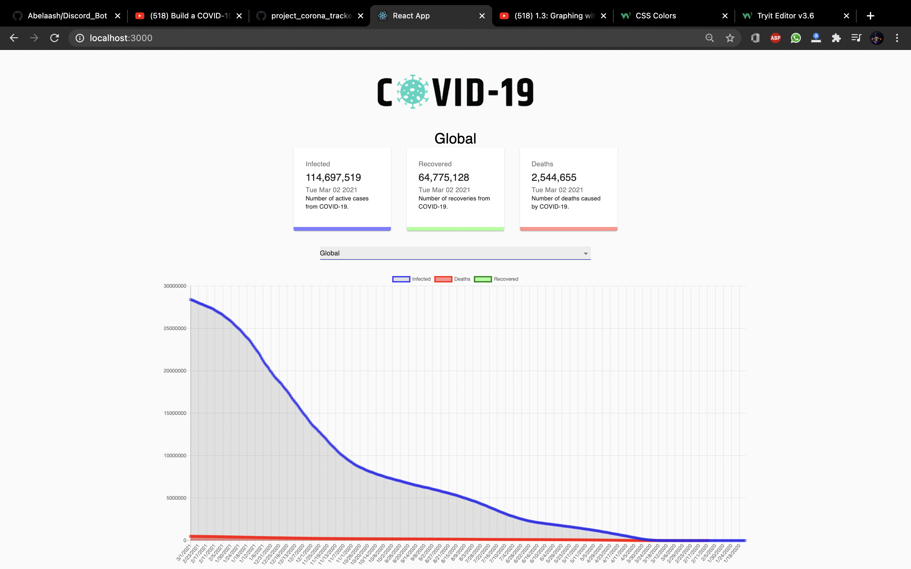
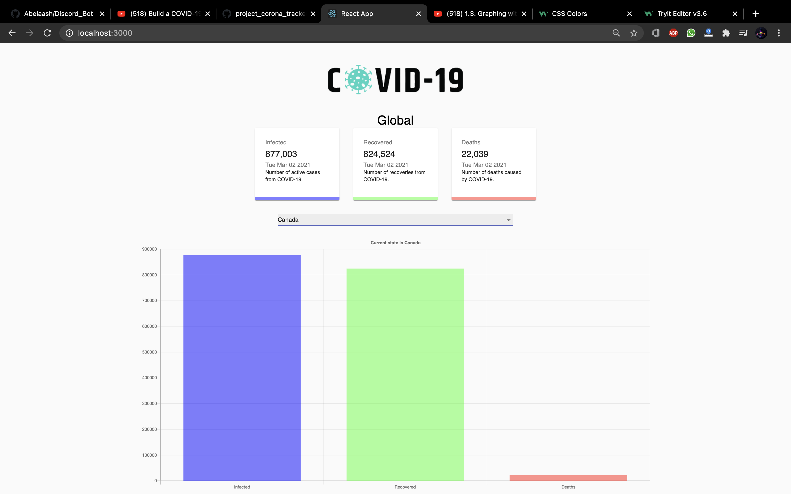

# This is my personal project that I created 
When launching the website you'll see the total cases, recovered and deaths in worldwide. The line charts shows the daily cases and also deaths but it doesn't show the recovered cases because the api wasn't updated but for the bar graph you'll see all the stats of their specific country

Here's the live website
[Website](https://world-tracker-covid19.herokuapp.com)
